# 吉利车机控制台 (GeelyToolbox v1.2.0)

专为搭载 **亿咖通 E02 / IHU516** 芯片的吉利汽车（缤越 COOL、缤瑞 COOL、博越、豪越、帝豪等 Android 9 SWOS 车机）量身打造的**新一代车载智能座舱控制台**。

集成 **座舱自动化联动与智能语音（转向360/大灯日夜/四门防开门杀/安全带提醒/熄火告别 · 原生集成替代TSK）**、**车载拟态智能座舱 UI（日夜双模 + 8 套精选护眼配色 + 100% 弹性视口自适应）**、**【一键卡兔子向导 (保姆级半自动)】Co-Pilot HUD 与确定性状态持久化**、**顶栏双轨动态暗码居中直出与悬浮窗同步**、**快捷通道黄金三剑客（文件管理/白名单放行/冻结应用商店）**、**双重启场景分流（5秒极速软重启 / 完整冷启动硬重启）**、**手机无线快传后台常驻（8888 端口 · 220px 超大动态矢量二维码扫码秒连）**、**车机全量应用深度管理（动态扫描 100+ 应用与行内 4 大操作）**、**车机 ADB 终端与核心组件冻结**、**全量系统操作防误触二次确认**、**ApkProvider 安全直调安装器** 与 **云端车载精选软件中心**。

---

## 软件界面实测预览

### 1. 座舱主控台全景首屏 · 白天日间高对比模式（1920×720 · 强光防反光）
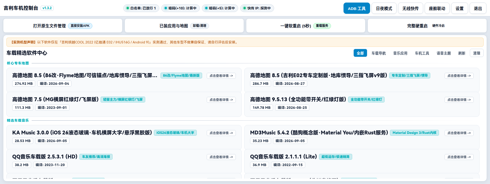

### 2. 座舱主控台全景首屏 · 夜间深色护眼模式（1920×720 · #0B1120 深邃黑蓝不晃眼）
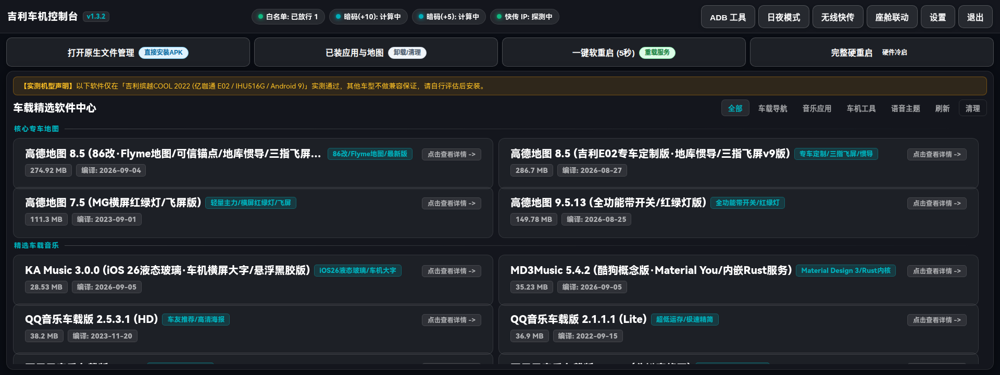

### 3. 【车机守护与系统设置】（开机自启 / 全局悬浮胶囊 / 快传后台常驻 / 8套护眼配色）
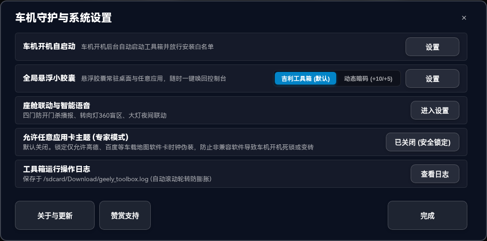

### 4. 【车机深度工具箱】二级抽屉（ADB 终端 / 动态暗码 / 存储清理 / 组件管理 / OTA 提取）
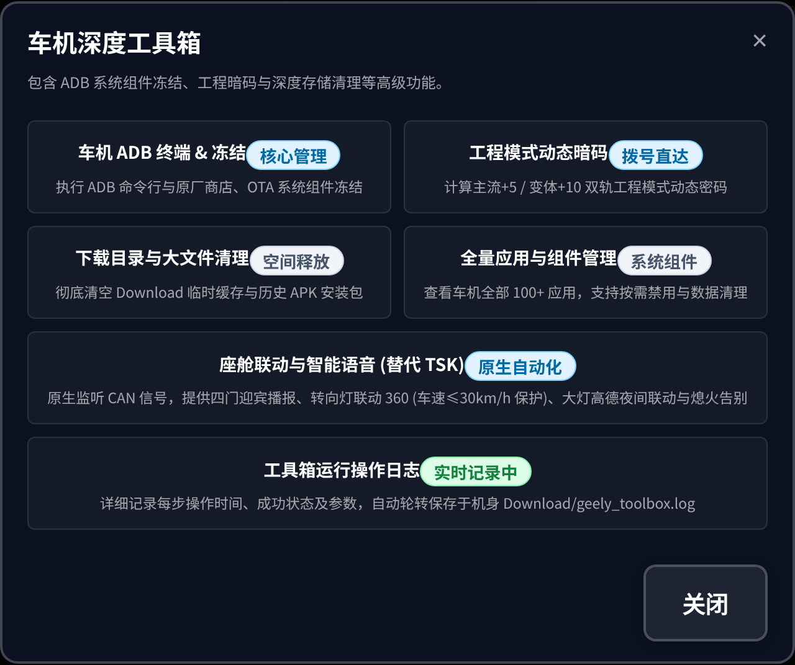

### 5. 【一键卡兔子向导 (保姆级半自动)】（高德专车版伪装打包 + 状态持久化）
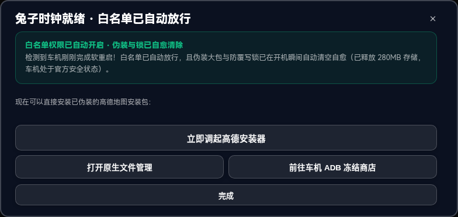

### 6. 【车机全量应用深度管理】（真实扫描 100+ 应用 · 分类 Tabs · 行内 4 大操作）
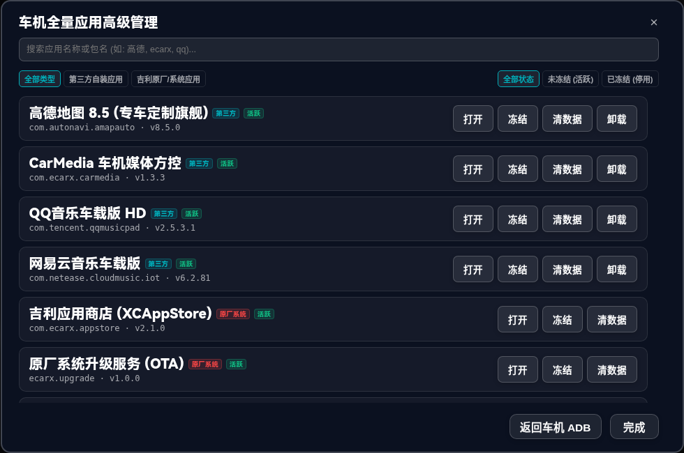

### 7. 【车机 ADB 核心组件冻结】（应用商店冻结锁死白名单 · OTA 拦截 · 伴听管理）
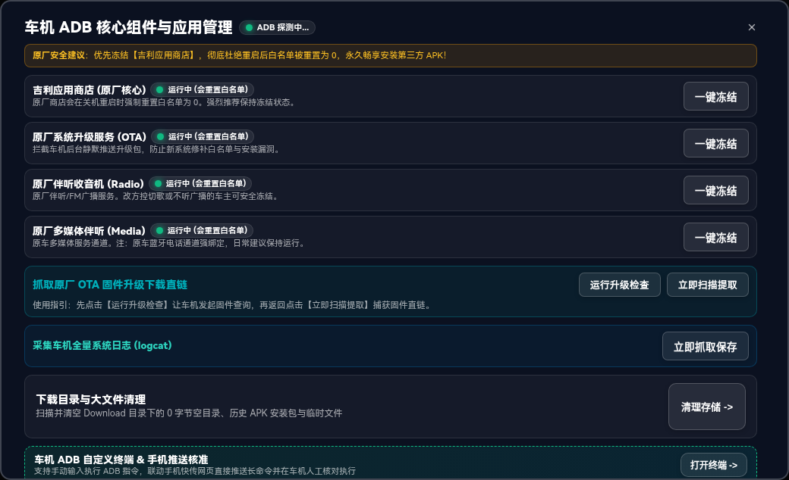

### 8. 【车机 ADB 自定义终端】（手机快连提示 · 命令输入 · 黑底绿字控制台视口）
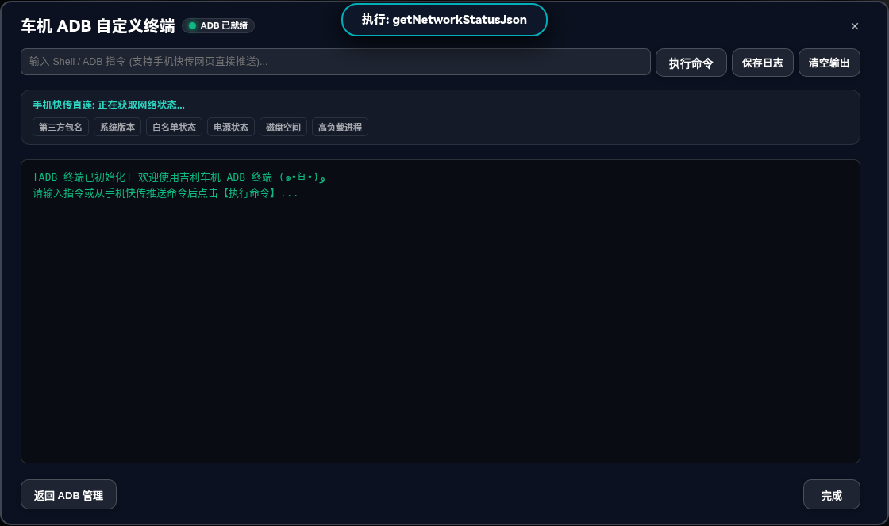

### 9. 【手机无线快传二维码】（8888 端口 · 220px 超大纯白底二维码 · 微信/相机扫码秒连）
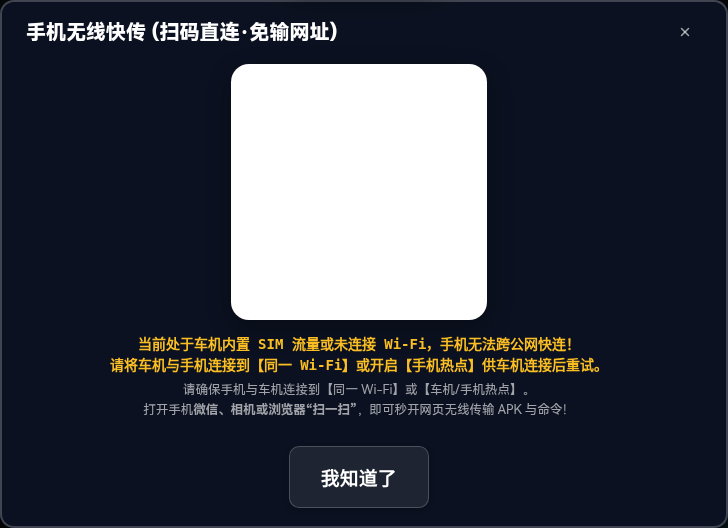

### 10. 【原厂工程模式动态暗码】（左加10 / 右加5 双轨 26px 大字直出 · 一键直达拨号盘）
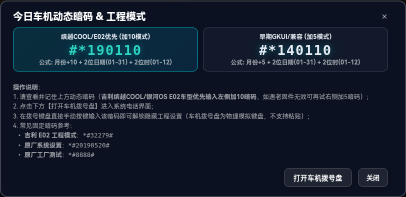

### 11. 【主题皮肤与 8 套护眼配色】（竹翠森林 / 暖阳琥珀 / 极简科技 / 极光曜青 / 落樱粉黛等）
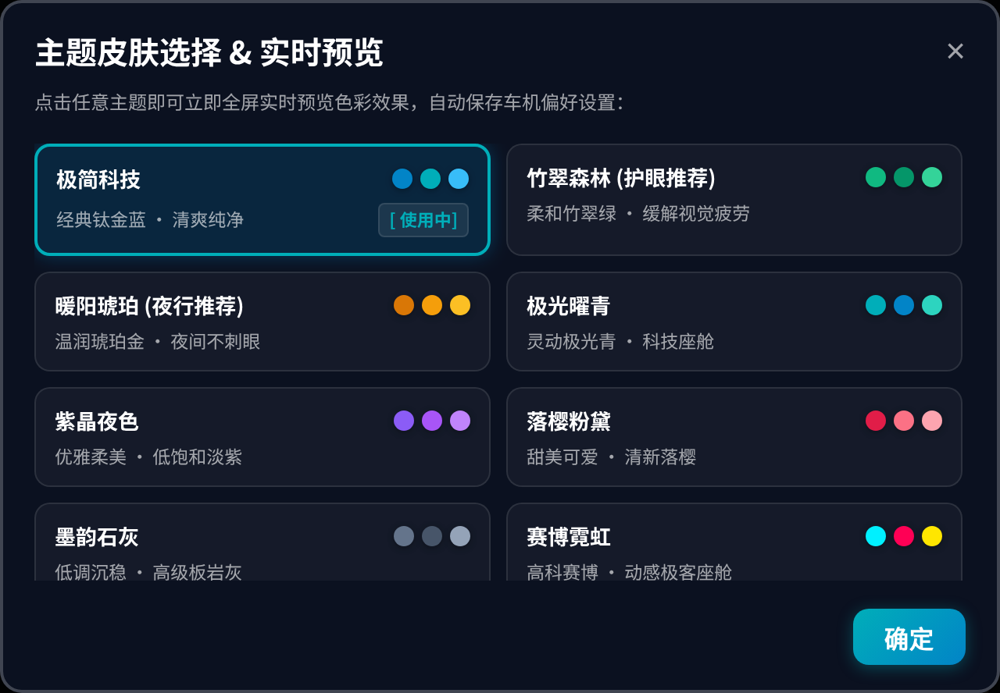

### 12. 【下载目录存储清理】（安全清理空文件夹 vs 彻底清空下载）
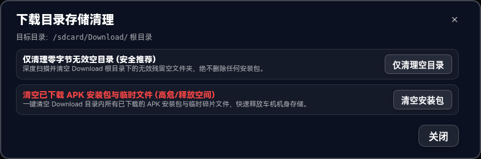

### 13. 【检查更新与自升级】（Glassmorphic 拟态弹窗 · 升级版本胶囊 · 更新日志）
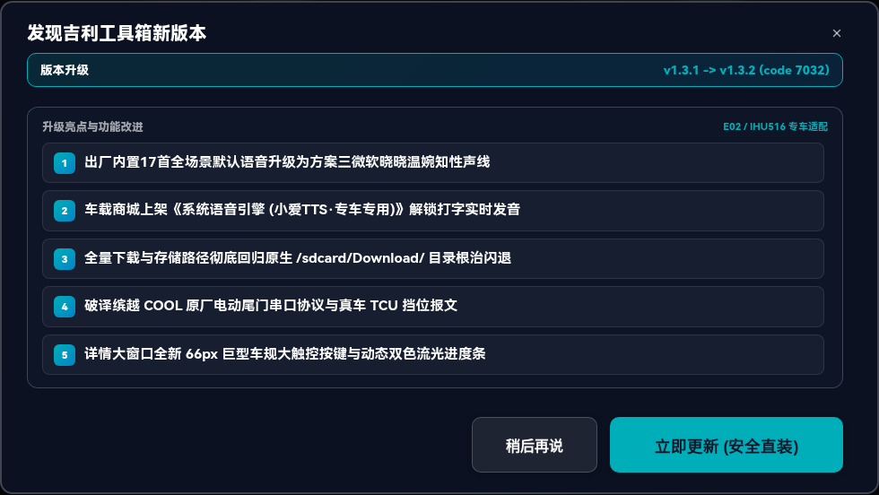

### 14. 【关于吉利车机控制台】（v1.1.9 · E02 / IHU516 专车架构 · 极简微边框按钮）
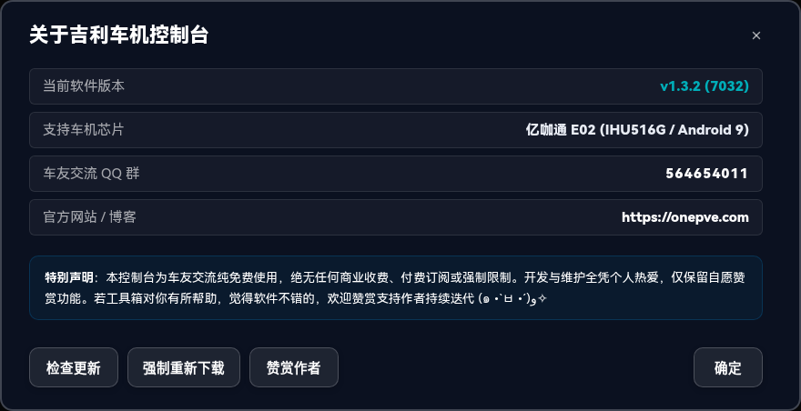

### 15. 【退出/最小化确认弹窗】（最小化到后台 vs 彻底退出双选）

### 16. 【系统操作二次防误触确认】（白名单放行 / 商店冻结 / 重启专属安全确认）

---

## 核心架构与功能特性

### 1. 车载拟态智能座舱 UI 标准（Automotive Smart Cockpit UI）
1. **100% 视口弹性自适应**：全比例动态适配 1920×720、1280×600 等各种吉利原厂与非标中控大屏，杜绝任何溢出裁切或界面错位；
2. **全场景日夜双模联动**：
   - **日间模式**：高对比科技亮色（#EEF1F6），在白天强光直射与车窗反光下依然字迹清晰、高视认性；
   - **夜间模式**：深邃护眼蓝黑底色（#0B1120）搭配微光呼吸灯，夜间行车柔和不刺眼；
   - **智能探测**：开机自检，底层接入车机 UI_MODE_NIGHT 状态检测（开大灯或进隧道自动切深色），顶栏常驻【日夜模式】一键手动切换锁定；
3. **8 套精选护眼主题配色**：支持实时预览切换 **极简科技 (Default)、极光曜青 (Aurora)、暖阳琥珀 (Amber)、竹翠森林 (Forest)、紫晶夜色 (Purple)、落樱粉黛 (Pink)、墨韵石灰 (Slate)、赛博霓虹 (Cyber)**；
4. **座舱视距超大触控按键**：左侧核心功能与快捷通道统一采用 **58px 超大按键（17~18px 超大粗体）**，右侧商城卡片 **84px 高度**，彻底杜绝驾驶视距下的误触；
5. **全界面 100% 纯文字与 0 Emoji 铁律**：彻底剥离 Unicode Emoji 字符，全面采用高质感纯文字与纯 CSS 类别徽标，彻底杜绝车机精简字库渲染为豆腐块乱码（□）；
6. **极速轻量与零框架损耗**：基于纯手写 Vanilla H5 + Android 原生 WebView 架构，离线 0 毫秒冷启动，运存严格压制在 **35MB**，CPU 占用接近 0%。

---

### 2. 【一键卡兔子向导 (保姆级半自动)】Co-Pilot HUD 与确定性状态持久化

#### 核心原理解析
吉利 E02 车机出厂内置原厂签名高德地图，第三方新版高德因签名与原厂不一致无法直接覆盖安装。
本工具箱通过将目标高德 APK 自动伪装打包为系统屏保时钟主题（`clock.rabbit.xtz`），并在车机主题中应用该屏保；系统会在底层静默将 APK 释放至底层存储，随后执行极速软重启重载系统服务，即可在文件管理中一键完成无损覆盖升级！

#### 保姆级向导标准 SOP
1. **后台秒级伪装打包与立 Flag**：后台自动将高德 APK 伪装打包写入 `/sdcard/XUI/theme/clock.rabbit.xtz` 并锁死防覆写，立下确定性持久化标志 `pending_install_after_reboot = true`；
2. **自动调起主题与挂起超大向导 HUD**：自动打开吉利原厂主题管理，屏幕顶部挂起 **200px 全景超大半透明悬浮保姆级向导 HUD（26sp 粗体白字）**，播报：`步骤 1/2: 请点击【屏保时钟】选【兔子时钟】并点应用 (提示成功/失败均已生效)`；
3. **实体大按键一键软重启**：HUD 右侧常驻 **`[我已应用，立即软重启]`**（高亮青蓝大按钮）与 `[完整硬重启]`；车友轻触应用后点按此键，工具箱毫秒级触发 5 秒极速软重启；
4. **开机 100% 确定性自动放行与弹窗**：彻底摒弃不可靠的时间戳比对，基于确定性持久化 Flag 机制，车机开机后工具箱 **100% 必定秒级自动放行白名单 (sys.jsbd.apk_verify=1) 并弹出高德安装器引导**；用户安装后自动复位 Flag。

---

### 3. 顶栏双轨动态暗码直出与悬浮窗同步展示

1. **原厂固件底层字节码实证算法**：源自原厂 `XCBTPhone3.apk` 底层 `com.ecarx.btphone.d.d` 逻辑；
2. **顶栏状态栏居中直出**：
   - **左侧【暗码(+10)】**：如 `#*190214`（缤越COOL 2022 / 银河OS E02 专属主算法）；
   - **右侧【暗码(+5)】**：如 `#*140214`（早期 GKUI / 兼容固件备用算法）；
   - 点击秒开原生车机电话拨号盘；
3. **全局悬浮小胶囊同步展示**：开启悬浮胶囊时，胶囊文字同步显示双轨暗码，车主在拨号盘界面看一眼悬浮窗即可轻松输入；
4. **严禁剪贴板复制误导**：车机拨号盘为物理硬件按键模拟，完全不支持剪贴板长按粘贴，界面彻底移除误导性复制逻辑。

---

### 4. 快捷通道黄金三剑客与双重启场景分流

#### 主屏快捷通道黄金三剑客
1. **`[原生文件管理]`**：一键唤起系统 DocumentsUI，直接浏览并点击安装 `/sdcard/Download/` 下的 APK；
2. **`[白名单放行]`**：实时探测 `sys.jsbd.apk_verify` 状态，胶囊指示 `已放行 / 未放行`，点击一键开启；
3. **`[冻结应用商店]`**：实时指示 `已冻结 / 运行中`，一键冻结原厂应用商店（`com.ecarx.appstore`），**锁死白名单彻底防止开机掉白名单**。

#### 双重启控制机制分流
1. **`一键软重启 (ctl.restart zygote)`**：极速 5~8 秒，仅重载 Android 虚拟机与主题服务，无需整车断电，不伤硬件，**卡兔子时钟升级高德极速首选**；
2. **`完整硬重启 (reboot)`**：25~35 秒整机冷启动，Linux 内核、MCU 与硬件电源彻底重新通电，**系统驱动卡死与深度排障备用**；
- 两者均配备专属二次防误触确认弹窗与醒目实心确认大按键。

---

### 5. 二级【车机深度工具箱】抽屉与全量应用管理

点击下方通栏大按钮直达二级抽屉，收纳深度进阶工具：

1. **车机 ADB 自定义终端**：
   - 顶部命令输入框 + 【执行命令】 + 【保存日志】（保存至 `/sdcard/Download/adb_terminal_YYYYMMDD_HHmmss.log`） + 【清屏】；
   - 终端内常驻局域网快连提示（`http://<车机IP>:8888`），网络智能判别（Wi-Fi 直连 vs SIM 流量告警）；
   - 黑底绿字控制台视口，带时间戳、耗时和退出码实时输出；
   - **Push-Review-Execute 铁律**：手机推送的指令仅填入车机输入框，必须由车主在车机大屏上手动点击【执行命令】，杜绝未经授权注入风险。
2. **车机全量应用高级管理**：
   - 动态扫描车机真实安装的全部 100+ 个系统与用户应用；
   - 支持即时模糊搜索（应用名或包名）；
   - 双重过滤 Tabs：类型（`全部类型 / 第三方自装应用 / 吉利原厂系统应用`）与状态（`全部状态 / 未冻结活跃 / 已冻结停用`）；
   - 行内 4 大完整操作：`打开`、`冻结 / 解冻`、`清除数据`、`卸载`。
3. **核心推荐冻结与 OTA 升级直链抓取**：
   - 一键冻结吉利应用商店（`com.ecarx.appstore`）、原厂系统升级服务（`ecarx.upgrade`）、原厂多媒体伴听（`com.ecarx.xcmedia`）；
   - 检索抓取原厂增量固件升级 `.zip` 下载直链；
   - 一键转储全量系统日志：`logcat -d -v time > /sdcard/Download/car_full.log`。
4. **下载目录存储清理**：
   - 选项一：`仅清理空文件夹 (安全推荐)`；
   - 选项二：`清空全部下载文件 (释放空间)`。

---

### 6. 持久化操作运行日志与自动自愈轮转系统 (v1.1.6 新增)

1. **自动记录每步操作**：记录白名单放行、兔子伪装注入、官方时钟还原、开机自愈巡检、应用冻结/解冻、ADB 执行及系统重启的具体时间戳与执行结果；
2. **持久化与大小滚动**：日志文件保存于 `/sdcard/Download/geely_toolbox.log`，单文件上限 2MB 自动滚动轮转（最多保留 3 个备份），启动时自动清除超过 7 天的历史滚动旧日志，绝不无限制占满机身存储；
3. **座舱端即时查看与清空**：在【车机设置】与【车机深度工具箱】中随时一键唤起日志查看弹窗，支持实时刷新、浏览最近 400 行关键操作流水与手动一键清空。

---

### 7. 座舱自动化联动与智能语音原生集成 (v1.1.7 新增 · 彻底替代 Tasker/TSK)

1. **底层 CAN 报文毫秒级解析**：基于系统底层 `logcat` 日志流与车载广播，直接解析方向盘打灯、车速、大灯与车门开关状态；
2. **转向灯联动 360 全景影像 (带车速安全过滤)**：打转向灯自动唤起 360 看盲区，转向灯回正自动关闭；**硬性限定仅在车速 ≤ 30 km/h 时允许唤起**，高速以 80~120km/h 变道时自动静默抑制，绝不遮挡高德导航；
3. **大灯联动高德日夜模式**：检测进隧道或天黑开大灯时，自动通知高德地图切换黑夜模式防刺眼；关大灯自动切回日间模式；
4. **座舱智能语音播报 (支持单项独立开关与音频替换)**：
   - 主驾开门防开门杀播报（*“主驾车门已打开，请注意后方来车”*）；
   - 副驾上车迎宾播报（*“副驾车门已打开，请注意安全”*）；
   - 副驾关门就坐系安全带播报（*“副驾已就坐，请系好安全带”*）；
   - 后排车门开启安全警示播报（*“后排车门已打开，请注意车外环境”*）；
   - 车辆熄火告别播报（*“车辆已熄火，请带好随身物品”*）；
5. **全内置高保真 MP3 音频 + 自由个性化替换**：直接内置 11 款高质量音频文件，零网络依赖、零合成延迟；每项均支持【试听】、【更换音频】与【重置】，车主可自由选取手机快传的 MP3 替换；
6. **悬浮胶囊切桌面防丢失深度自愈**：升级为前台服务常驻守护，引入 4 级 WindowManager 自动降级挂载策略与生命周期 `onStop()` 强制重刷置顶，彻底根治原厂 Launcher 切桌面丢失胶囊的问题；
7. **零侵入与零资源占用**：所有自动化功能**默认全部保持关闭（Default OFF）**，未开启时自动销毁后台线程与服务，不占用任何 CPU 与运存。

---

### 8. 车规黑白自适应与大方块磁贴重构 (v1.1.9 新增)

1. **按键全面升级为大方块车规磁贴**：兔子时钟核心区按键升级为 **2×2 大方块磁贴**（高度拉伸至 `76px`，主副标题双行标），快捷通道按键高度同步提升至 `76px`，彻底杜绝细长扁条，车载远视距触控容错率大幅提升；
2. **纯净黑白自适应车规视觉**：彻底拔除所有引导性蓝色与彩色高亮渐变，白天温润微边框、夜间碳黑磨砂，100% 护眼防眩光，弹窗确认与取消按键平级中性化；
3. **全功能二次/三次防误触核准全覆盖**：所有操作按键补充详尽的操作说明、适用场景与执行流程，清空与卸载等高危操作强制执行 3 步递进校验，软硬重启接入全屏防狂点遮罩；
4. **移除冗余还原官方时钟按键**：依托开机与安装完成全自动秒级自愈机制，彻底移除无用的手动还原按键；
5. **CI 自动化 5 大资产清理与健康门禁**：工作流末尾全自动清理旧 tags、旧 releases、旧 runs、旧 artifacts 与旧 caches，并在编译前接入死链与 JSBridge 契约健康门禁。

---

### 9. 现代化车载拟态 UI 重构与旧灰底清除 (v1.1.8 新增)

1. **更新说明弹窗精致拟态化**：重构检查更新与自升级弹窗，去除旧版挤在一起的灰色背景框，升级为 `update-badge-flow` 流动版本横幅与带数字序号（01、02...）的列表卡片流；
2. **全站弹窗统一去灰底**：统一引入 `.modal-info-box` 标准拟态卡片，高德安装指引、开机自愈通知、操作意图核准与多版本选择弹窗全量告别旧灰底；
3. **彻底消除原生系统深灰弹窗**：将底层 8 处 Android 9 原厂系统级 `AlertDialog` 彻底移除，统一收敛为车载拟态确认弹窗与非阻塞 Toast 提示，车机交互体验完全一体化。

---

### 9. 手机无线快传（8888 端口 · 超大号矢量二维码）

1. **端口统一固定为 `8888`**（`http://<车机IP>:8888`），彻底规避 8080 端口冲突；
2. **启动即常驻**：工具箱启动后默认常驻开启 WebServer（8888 端口），只要车机连上 Wi-Fi 或热点，手机随时访问秒连；
3. **超大号纯白底二维码**：弹窗正中提供 **`220px × 220px` 超高对比度纯白底标准二维码**（内置离线 Reed-Solomon 编码引擎），微信/相机扫一扫秒开网页；
4. **双向互传闭环**：
   - 手机向车机推送外部 APK 下载链接；
   - 手机本地 APK / ZIP 文件秒传至车机（同名文件智能顺延重命名，不覆盖历史测试包）；
   - 手机推送长命令到车机终端屏幕；
   - 车机下载目录物理文件（系统日志、ADB 日志、安装包）反向下载导出到手机。

---

### 10. 云端车载精选软件生态（16 款实测精选）

所有软件以 APK 内部真实编译时间为准标注【编译: YYYY-MM-DD】：

1. **高德地图 8.5 (86改·可信锚点最新版)**：作者 AE86，纯 64 位原生编译，深度重构 EAS 5007 可信视觉锚点与融合定位流，针对冷启动首帧渲染与地库惯导优化，体积优化至 274.92MB，支持地库陀螺仪惯导与三指飞屏 [编译: 2026-09-04]；
2. **高德地图 8.5 (吉利E02专车定制版·v9)**：作者 QQ: 513677649，吉利 E02 专车定制魔改版，纯 64 位原生编译，支持陀螺仪地库惯导与三指飞屏（286.7 MB）[编译: 2026-08-27]；
3. **高德地图 7.5 (MG横屏红绿灯/飞屏版)**：轻量主力版，仅 111MB 极速省运存，支持城市全向红绿灯实时读秒与仪表飞屏（111.3 MB）[编译: 2023-09-01]；
4. **高德地图 9.5.13 (MG全功能带开关/红绿灯版)**：全新现代 UI，支持车道级实景与红绿灯倒计时（149.78 MB）[编译: 2026-08-25]；
5. **CarMedia 车机媒体 1.3.3 (米小江稳定推荐版)**：现役成熟方控标准，开机自启，完美接管方向盘物理按键切歌/播放暂停与 EAS 蓝牙音频通道（749 KB）[编译: 2026-08-30]；
6. **多媒体桥接 5.1 (全能歌词/全系音乐桥接)**：聚合 QQ音乐/网易云/汽水音乐/酷我全系歌词桥接，仪表盘/HUD/大屏双向同步（523 KB）[编译: 2026-08-13]；
7. **驾途 3.13 (高德巡航/支持下轮灯联动)**：悬浮车速、电子眼限速与吉利原厂下轮灯联动（538 KB）[编译: 2026-08-02]；
8. **歌词伴侣 20260822 (车载全能悬浮歌词/蓝牙同步)**：蓝牙音频抓取与状态栏/悬浮窗逐字歌词（4.76 MB）[编译: 2026-08-22]；
9. **QQ音乐车载版 2.5.3.1 (HD)**：官方正版横屏，高品质无损音质（38.2 MB）[编译: 2023-11-20]；
10. **QQ音乐车载版 2.1.1.1 (Lite)**：超低运存仅 45MB，极速精简（36.9 MB）[编译: 2022-09-15]；
11. **网易云音乐车载版 6.2.81**：沉浸式旋转黑胶大盘 UI，杜比全景声（70.9 MB）[编译: 2025-12-12]；
12. **网易云音乐车载版 3.2.46 (分辨率修正)**：吉利分辨率修正版（48.9 MB）[编译: 2023-07-29]；
13. **汽水音乐 1.0.10 (官方车机版)**：字节跳动官方出品，抖音收藏夹实时互通，原生适配吉利 ECARX OpenAPI 悬浮歌词与方控切歌（37.97 MB）[编译: 2026-05-26]；
14. **方向盘切歌助手 1.0.0 (旧版备用)**：历史旧版备用方控（1.1 MB）[编译: 2024-01-10]；
16. **吉利原厂降级救砖固件 (IHU516可adb包)**：缤越COOL原厂纯净救砖固件，安全命名免疫开机循环刷机（2.65 GB）[编译: 2022-08-08]。

---

## 构建与分发说明

- **开发语言**：Java (Android 9 API 28 / targetSdk 28) + Vanilla HTML5/CSS3/JavaScript
- **分发直链**：`https://example.com/GeelyToolbox/GeelyToolbox.apk`
- **CI / CD 工作流**：
  - `push: branches: [main]`：仅执行自动化编译校验与代码检查（不上传、不发版）；
  - `push: tags: ['v*']`：触发正式打包、上传 Cloudflare R2 对象存储、更新 `version.json` / `apps.json` 并创建 GitHub Release。

---

## 免责声明

1. 本工具箱仅供吉利车友个人学习研究与车载大屏交互探索使用；
2. 行车过程中严禁分心操作车机大屏，安全驾驶是第一要素；
3. 本项目完全开源免费，请勿用于任何商业盈利目的。
