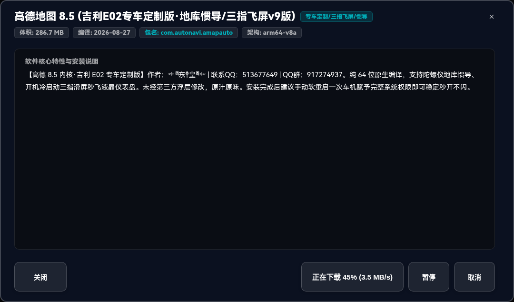
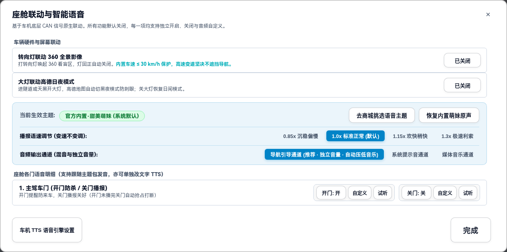
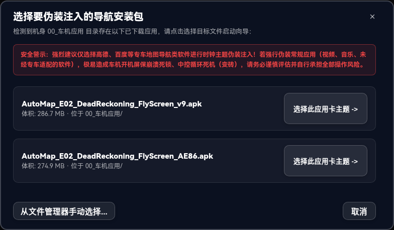
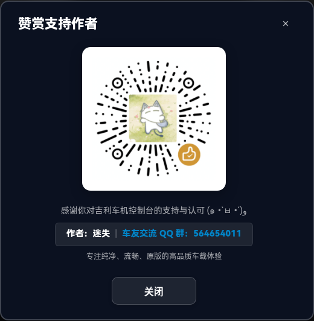

# 吉利车机控制台 (GeelyToolbox v1.2.9)

专为搭载 **亿咖通 E02 / IHU516** 芯片的吉利汽车（缤越 COOL、缤瑞 COOL、博越、豪越、帝豪等 Android 9 SWOS 车机系统）量身打造的**新一代车载智能座舱控制台**。

集成 **座舱自动化联动与智能语音（转向 360 联动 / 四门开关门迎宾告别 / 后备箱开关播报 / 安全带提醒 / 熄火告别 · 原生集成）**、**车载车规级中性极简 UI（纯净昼夜双模自适应 + 100% 弹性宽屏视口）**、**软件商城动态单一真实源解耦（冷启动静默秒同步云端 apps.json）**、**二级详情大窗口交互闭环（满幅卡片 + 48px 车规大触控按钮）**、**专属置顶自愈安装目录（/sdcard/Download/00_车机应用/ · ASCII 48 绝对置顶 · 原生文件管理自愈直达）**、**存储清理双向深度治理（00_车机应用专属目录与 Download 根目录系统残留空文件夹一键深度扫除）**、**顶栏双轨动态暗码居中直出（+10 / +5 双算法直连电话拨号盘）**、**专家模式安全门禁锁（卡兔子向导默认隐藏 + 5秒倒计时防闭眼盲点锁）**、**车机 ADB 核心组件与全量应用管理（一键冻结原厂商店锁死白名单 / 抓取 OTA 直链 / 日志采集 / 自定义终端）**、**手机无线快传后台常驻（8888 端口 · 220px 纯白底大二维码扫码连接）** 与 **云端车载精选软件中心**。

---

## 软件实测预览

### 1. 座舱主控台全景首屏 · 日间亮色模式（1920×720 · 跟随系统）

### 2. 座舱主控台全景首屏 · 夜间深色模式（1920×720 · 跟随系统）

### 3. 【软件详情与下载管理】二级大窗口（纯64位参数 / 核心特性 / 实时网速进度 / 原生直装）

### 4. 【车机 ADB 核心组件与应用管理】（原厂商店冻结 / 锁死白名单 / 存储清理 / OTA直链）

### 5. 【车机 ADB 自定义终端】（手机快连提示 / 命令输入 / 黑底绿字控制台视口）

### 6. 【原厂工程模式动态暗码】（左加10 / 右加5 双轨 27px 大字直出 · 一键秒开系统拨号盘）

### 7. 【下载目录存储清理】（00_车机应用 与 Download 根目录系统残留空文件夹双向治理）

### 8. 【车机守护与系统设置】（全局悬浮双态胶囊 / 开机自启 / 专家模式安全锁 / 赞赏支持）

### 9. 【座舱自动化与全车开关门语音】（四门开关门 / 尾箱开关 / 抢占式打断 / 360及夜间联动）

### 10. 【车机全量应用深度管理】（真实扫描 100+ 应用 · 分类 Tabs · 行内冻结/卸载/清理）

### 11. 【手机无线快传二维码】（8888 端口 · 220px 超大纯白底二维码 · 微信/相机扫码连接）

### 12. 【检查更新与自升级】（流光进度条与实时网速 · 下载完成快速调起安装自愈）

### 13. 【一键卡兔子向导与安全门禁】（自主选择目标应用 · 5秒强制倒计时变砖防护锁）

### 14. 【关于吉利车机控制台】（纯免费使用声明 / 车友交流 QQ 群 564654011）

### 15. 【赞赏与支持作者】（作者名片胶囊 · 微信与支付宝双码赞赏）

### 16. 【退出/最小化确认弹窗】（最小化到后台常驻 vs 彻底退出）

---

## 核心架构与功能规范

### 1. 车规级中性极简 UI 标准
1. **100% 弹性视口自适应**：精准适配吉利主流 1920×720 宽屏（及其他车规比例），字号、内边距与网格动态自适应，彻底告别文字挤压换行或大屏过度留白；
2. **纯净车规黑白昼夜双模**：白天纯白微边框，夜间深邃黑蓝（#0B1120），跟随系统自动切换，柔和舒适；
3. **彻底清除所有 Emoji 图标**：全站所有标题、说明及按键左侧彻底移除任何 Unicode Emoji，保持纯净规范中文，彻底杜绝车机字体库缺失导致的缺字方块（□）；
4. **座舱大触控容错率**：顶部快捷通道采用 2×2 饱满大方块（主副标题双行标），弹窗按钮统一采用 48px 车规大高度，驾驶视距触控精准防误触。

### 2. 软件商城动态单一真实源（Single Source of Truth）
1. **云端动态解耦**：控制台底层 Java 线程在冷启动 1 秒后自动静默拉取云端 `apps.json`；
2. **热更新无需发版**：软件新增、下架、升级或文案调整只需更新云端元数据，车机端即时自动按最新列表镜像重构；
3. **二级详情大窗口交互闭环**：外层卡片移除笨重下载按钮与跑马灯折行，满幅舒展；所有下载、暂停、重试、覆盖与直接安装全量收敛至二级详情大窗口；
4. **双向实时进度联动**：原生下载引擎通过 `Accept-Encoding: identity` 保障报头真实透传，下载进度与网速在详情大窗口中毫快速同步呈现。

### 3. 专属置顶自愈下载目录（`/sdcard/Download/00_车机应用/`）
1. **ASCII 48 绝对置顶**：数字 `0`（ASCII 值 48）字典序天然排在所有英文字母（A-Z）与中文之前，在任何系统自带或第三方文件管理器中稳居最顶部第 1 位；
2. **纯标准字符零转义风险**：彻底摒弃感叹号等特殊字符，完美规避 Shell/Bash 历史展开语法异常与 ContentProvider Document URI 编解码冲突；
3. **全业务链路统一沉淀**：商城所有应用下载、控制台自更新、手机快传文件接收统一落盘于该目录；
4. **安装器故障自动自愈**：当调起系统安装器失败或车机未装系统设置时，底层自动捕获异常并调用 DocumentsUI 文件管理器直达 `00_车机应用` 目录实现自愈。

### 4. 存储清理双向深度治理
1. **专属目录深度清扫**：一键彻底清空 `00_车机应用/` 下的历史 APK 安装包与临时碎片；
2. **根目录系统垃圾清除**：自动深度扫描 `/sdcard/Download/` 根目录下由系统自动生成的各种 0 字节无效空文件夹（如 `tencent`、`ECARX`、`backup` 等）并彻底清除；
3. **白名单硬隔离防护**：清理过程中底层加锁保护 `00_车机应用` 目录本体，且绝不误删任何已安装应用数据与歌曲。

### 5. 顶栏双轨动态暗码居中直出
1. **双轨算法并列展示**：顶栏直接呈现 `[暗码(+10)]`（缤越 COOL / 银河OS E02 优先）与 `[暗码(+5)]`（早期 GKUI 兼容），一进系统一目了然；
2. **一键直达工程模式**：点击暗码胶囊无多余 Toast 干扰，直接展开 27px 动态暗码大卡片并直出【打开车机拨号盘】按键；
3. **严禁剪贴板误导**：车机拨号盘为物理硬件模拟键盘不支持粘贴，界面仅清晰呈现暗码值供车主对照输入。

### 6. 座舱自动化联动与全车四门/后备箱语音
1. **四门及后备箱全语音覆盖**：主驾、副驾、左后门、右后门以及后备箱的打开与关闭均配备独立语音播报与开关配置；
2. **抢占式打断机制**：开门语音播报中若车门关闭，立即掐断开门语音，无缝切入播放关门提示；
3. **冷启动双防线杜绝误报**：底导 `logcat` 监听强制追加 `-T 1` 参数彻底阻断旧日志回放；首包接收时仅建立车况开闭基准（`lastDoor == -1` 静默返回），仅在后续真实状态跃变时才发声播报；
4. **自定义 TTS 文字改写**：内置文字输入弹窗，支持全量自定义语音播报台词并联动系统发音人。

### 7. 专家模式安全锁与五秒倒计时门禁
1. **卡兔子向导默认彻底隐藏**：普通车友默认仅使用原生安全直装，彻底消除误操作变砖隐患；
2. **强制五秒倒计时警示**：开启专家模式的三步安全弹窗强制加入 5 秒倒计时锁定，倒计时结束前锁定置灰按键，彻底杜绝闭眼盲点跳过风险；
3. **防覆写锁按需生效与开机自愈**：平时真实显示“未伪装 / 官方原生屏保”，仅在真正卡主题注入时创建锁，软重启后开机自愈进程自动清场伪装包与锁文件恢复出厂默认。

### 8. 车机 ADB 核心组件与全量应用管理
1. **应用商店一键冻结**：提权至 Shell 2000 执行 `pm disable-user`，锁死原厂商店白名单，彻底阻断原厂后台自动静默卸载第三方软件；
2. **原厂 OTA 直链抓取**：一键打开系统更新并实时抓取车机全量升级固件直链；
3. **全量应用高级管理**：毫快速扫描车机 100+ 全量系统与第三方应用，支持按需禁用、清除数据与卸载。

### 9. 手机无线快传（8888 端口 · 纯白大二维码）
1. **端口固定常驻**：后台常驻监听 8888 端口，同局域网手机随时扫码连接；
2. **纯白大底二维码**：正中提供 220px 纯白底标准二维码，微信/系统相机扫码即开；
3. **双向互传闭环**：手机向车机极速直传大文件、手机推送长指令至车机终端、车机日志与 APK 反向导出至手机。

### 10. 云端车载精选软件生态（15 款实车实测精选）
1. **高德地图 8.5 (86改·Flyme地图/可信锚点最新版)**：纯 64 位原生编译，重构 EAS 5007 视觉锚点与融合定位流，支持地库陀螺仪惯导与三指飞屏（274.92 MB）；
2. **高德地图 8.5 (吉利E02专车定制版·v9)**：作者：༺ༀ东༒皇ༀ༻ (QQ: 513677649，QQ群: 917274937)，纯 64 位专车版，支持陀螺仪地库惯导与三指飞屏（286.7 MB）；
3. **高德地图 7.5 (MG横屏红绿灯/飞屏版)**：轻量主力版，仅 111MB 极速省运存，支持城市全向红绿灯实时读秒与仪表飞屏（111.3 MB）；
4. **高德地图 9.5.13 (全功能带开关/红绿灯版)**：全新现代车道级实景导航与红绿灯读秒（149.78 MB）；
5. **KA Music 3.0.0 (车机横屏版)**：iOS 26 液态玻璃风格，全网千万曲库无损畅听（18.9 MB）；
6. **MD3Music 5.4.2 (酷狗概念版)**：Material You 拟态自适应质感，极致轻量（41.9 MB）；
7. **QQ音乐车载版 2.5.3.1 (HD)**：官方正版横屏，高品质无损音质（38.2 MB）；
8. **QQ音乐车载版 2.1.1.1 (Lite)**：超低运存仅 45MB，极速启动（36.9 MB）；
9. **网易云音乐车载版 6.2.81**：沉浸式旋转黑胶大盘 UI，杜比全景声（70.9 MB）；
10. **网易云音乐车载版 3.2.46 (分辨率修正)**：吉利专车分辨率适配版（48.9 MB）；
11. **汽水音乐 1.0.10 (官方车机版)**：字节跳动官方出品，抖音收藏夹实时互通，原生适配吉利 ECARX OpenAPI 悬浮歌词与方控切歌（37.97 MB）；
12. **CarMedia 车机媒体 1.3.3 (稳定推荐版)**：作者：米小江 (QQ群: 917274937)，现役成熟方控，开机自启，接管方向盘切歌与播放暂停（749 KB）；
13. **歌词伴侣 (车载全能悬浮歌词/蓝牙同步)**：车友交流QQ群: 1049772727，蓝牙音频抓取与状态栏/悬浮窗逐字歌词（4.76 MB）；
14. **原生系统设置 (Android 9 · 缤越COOL实测)**：缤越 COOL 原厂提取，放行白名单后直接安装，解锁系统级安装器与原生蓝牙配置（30.7 MB）；
15. **驾途 3.17 (高德巡航/支持下轮灯联动)**：作者：泉歆泉伊 (QQ: 571967931，QQ群: 1106923186)，专为车机高德设计，悬浮车速、电子眼限速与吉利原厂下轮灯联动（547 KB）。

---

## 交流反馈与公益声明

- **纯免费公益声明**：本控制台为吉利车友圈纯免费公益软件，**没有任何商业收费项目**；觉得软件好用的车友可通过内置赞赏码自愿赞赏支持作者持续迭代；
- **车友交流 QQ 群**：`564654011`

---

## 免责声明

1. 本控制台仅供吉利车友个人学习研究与车载大屏交互探索使用；
2. 行车过程中严禁分心操作车机大屏，安全驾驶是第一要素；
3. 因个人自行开启专家模式伪装非适配应用导致的车机卡死或变砖风险，须自行承担相应责任。
