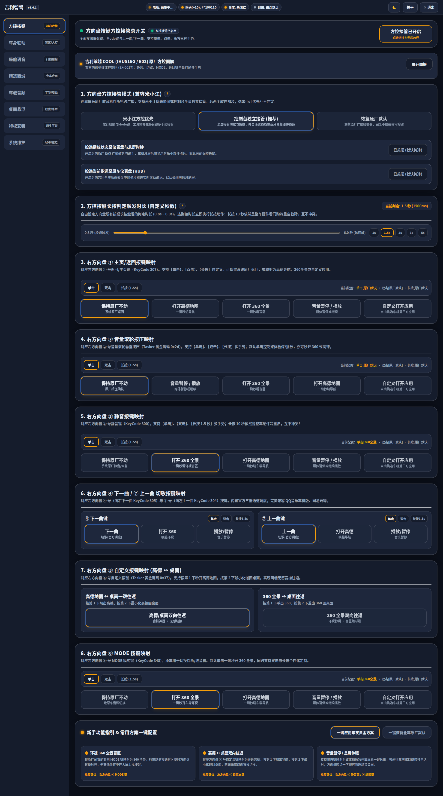
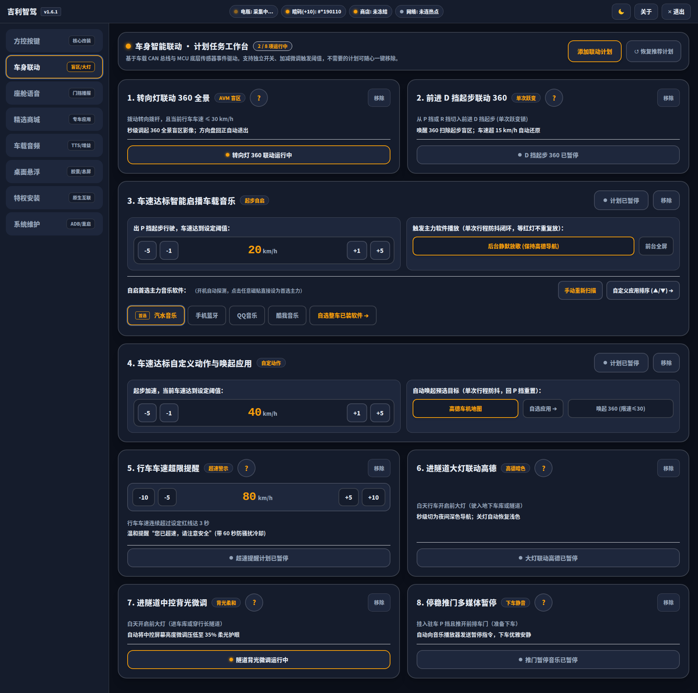
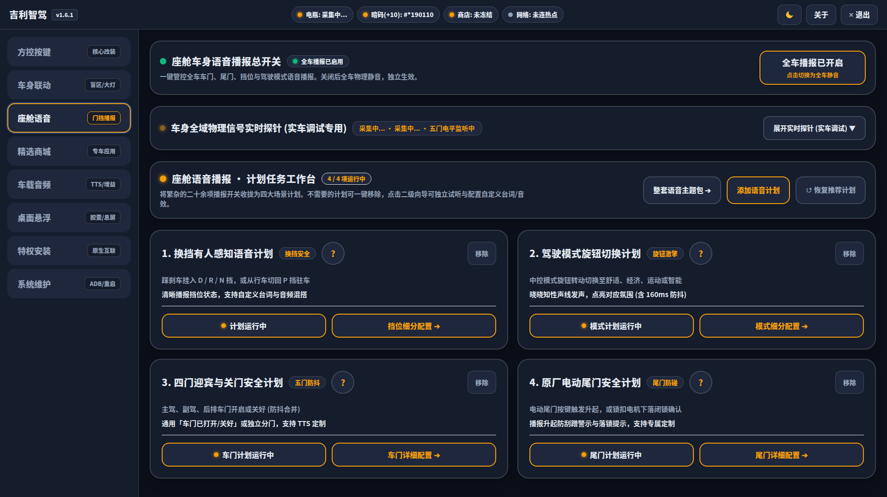
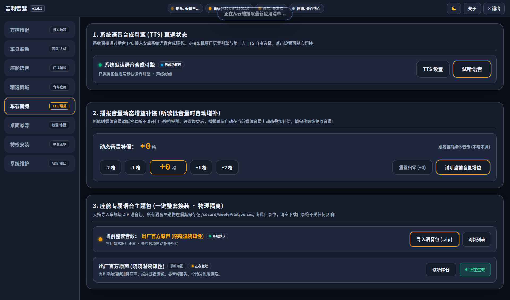
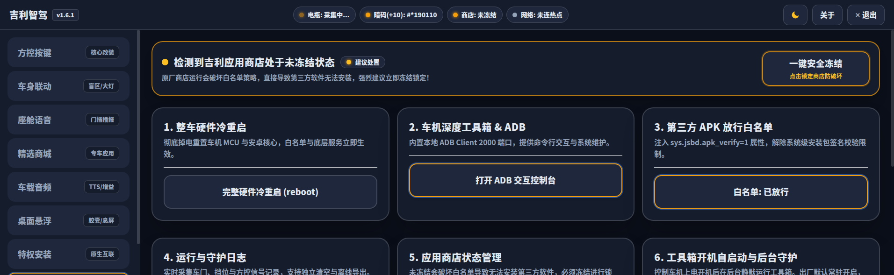
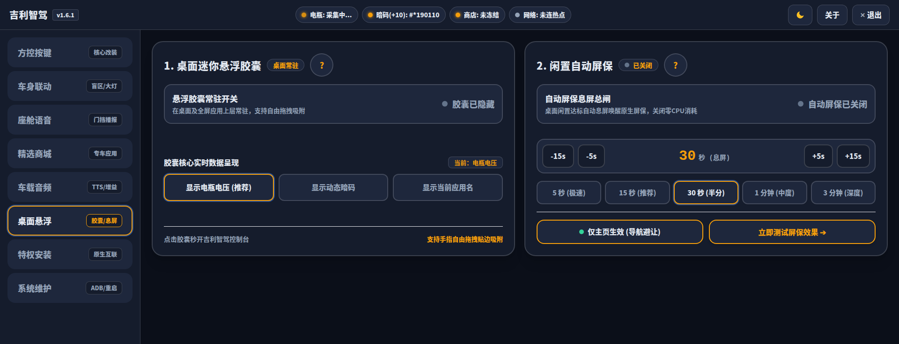
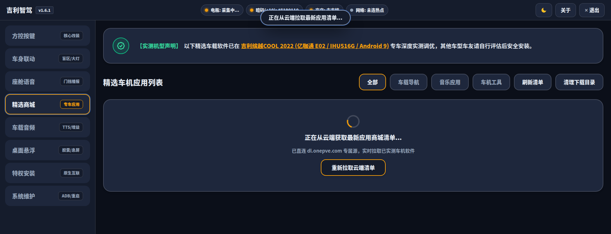
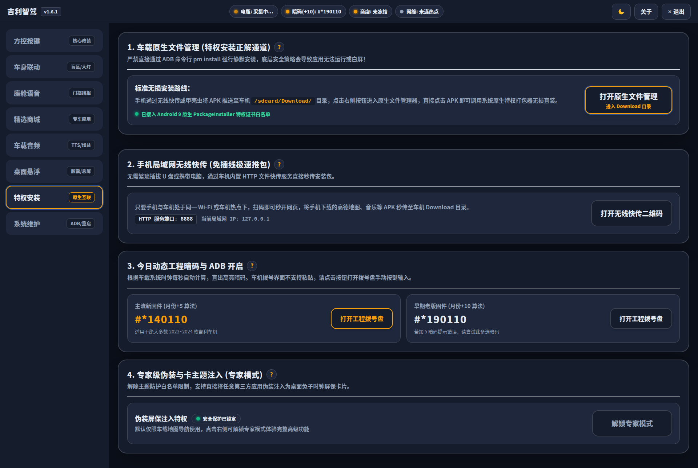
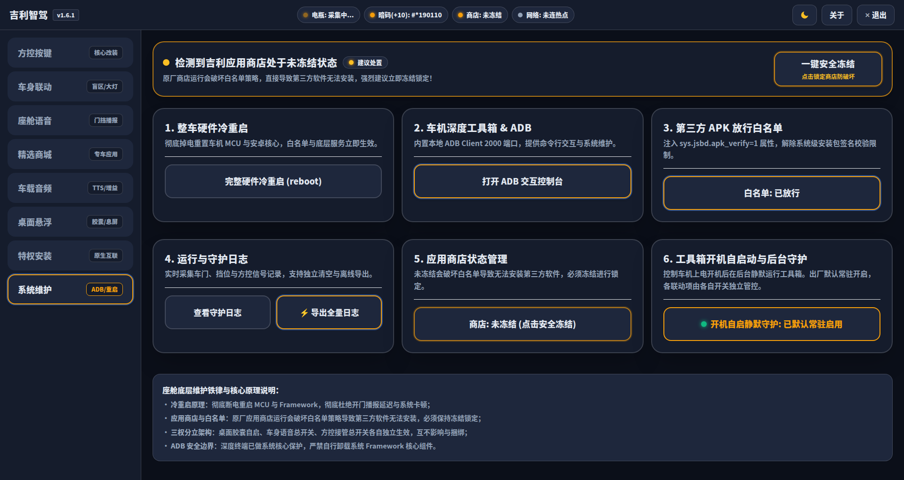

# 吉利智驾 (GeelyToolbox)

专为搭载 **亿咖通 E02 / IHU516** 芯片的吉利汽车（缤越 COOL、缤瑞 COOL、博越、豪越、帝豪等 Android 9 SWOS 车机系统）量身打造的**新一代全能车载智能座舱控制中枢**。

---

## 📌 项目信息与官方图文教程

- **官方保姆级图文教程**：<a href="https://onepve.com/geely-toolbox-guide/" target="_blank" rel="noopener noreferrer">吉利智驾 (GeelyToolbox) 从零初始化与座舱实战全指南</a>
- **GitHub 开源仓库**：<a href="https://github.com/onepve/GeelyToolbox" target="_blank" rel="noopener noreferrer">onepve/GeelyToolbox</a>
- **最新正式版本**：`v1.7.32` (versionCode `1073299`)
- **官方直装下载直链**：<a href="https://dl.onepve.com/GeelyToolbox/GeelyToolbox.apk?v=1.7.32" target="_blank" rel="noopener noreferrer">GeelyToolbox.apk (v1.7.32 · 正式版)</a>
- **版本元数据接口**：<a href="https://dl.onepve.com/GeelyToolbox/version.json" target="_blank" rel="noopener noreferrer">version.json</a>
- **配套软件源接口**：<a href="https://dl.onepve.com/GeelyToolbox/apps.json" target="_blank" rel="noopener noreferrer">apps.json</a>
- **全栈设计系统规范**：<a href="https://onepve.com/geely-toolbox-guide/" target="_blank" rel="noopener noreferrer">OnePve Design (PPanel 极简美学规范)</a>
- **车友交流 QQ 群**：`564654011`

---

## 🚀 核心架构与功能一览 (v1.7.32)

1. **全新 OnePve Design 极简美学架构 (Dark Glassmorphism)**：全面基于 Vite + Vue 3 + Tailwind CSS 纯组件化工程重构，采用深邃星空漫反射大底座、PPanel 同款亚克力微透悬浮卡片、日夜双模无缝自适应；
2. **黄金车规大磁贴与暖阳琥珀光环 (Halo Ring)**：按键高度精准收敛为 **78~88px 黄金触控大磁贴**，文字保持默认高对比（夜间纯白/白天墨黑），金色外圈严格且仅用于工具箱自研监控/接管按键；
3. **守护日志彻底纯内存化 (Memory RingBuffer)**：底层采用 500 行内存环形缓冲区驱动，换挡/模式/车门/方控报文**100% 仅在 RAM 内存流转，平时零磁盘写入、零闪存磨损**；弹窗支持一键压缩导出为轻量 **`Geely_Log_Guard_*.zip`**；
4. **车机全量日志打包粉碎 (Geely_Log_Full_*.zip)**：ADB 控制台一键抓取整车底层 logcat 与 CAN 总线报文，临时拆分的数十兆 log 文件在打包完成后**第 1 毫秒物理粉碎删除**，磁盘零残留碎片；
5. **行车电瓶电压纯内存流转**：彻底拔除行驶中接收电压报文的高频同步写盘，静态内存流转为主，仅在电压大幅跃变 ≥0.2V 时异步记忆，彻底消除行车闪存磨损；
6. **方向盘按键深度接管 (SX-0017 七键图解)**：出厂默认【控制台独立接管】，短按 Mode 键秒级唤起 360 环视或导航，后台毫秒级补发解静音指令抵消误触发；静音键长按 10 秒看门狗冷重启救砖 100% 保留；
7. **智能有人感知换挡状态机**：出厂停泊锁死 P 挡基准，支持司机上车踩刹车提前开走武装与挂回 P 挡闭环播报；
8. **驾驶模式双向循环滚动与智能基准**：上拨 `智能➔舒适➔经济➔运动➔智能`，下拨反向，原车行车电脑广播最终目标模式监听与 160ms 防抖；
9. **系统首选 TTS 直通与原生解绑**：彻底解绑第三方小爱，原生对接系统首选引擎 (原厂 XCTtsEngine / 科大讯飞 / 亿咖通)，动态反射真实包名；默认优先播放纯净微软晓晓知性原声；
10. **车身智能联动八大计划任务**：打转向灯联动 360、进隧道白天开大灯中控背光自动微调至 35% 防眩目（出厂默认开启）、车速达阈值联动高德地图（360 标注原厂限速 ≤30km/h 限制）；
11. **精选软件商城 100% 纯云端动态化**：全生命周期由云端 R2 apps.json 动态下发呈现；全新上架 **Via 极轻横屏浏览器 (4MB)** 与 **Cx 文件管理器 (横屏大屏车规版)**，下架小爱 TTS；
12. **18 大车规级硬核 CI 自动化健康防御门禁**：涵盖 Java 静态符号完整性、Node.js AST 语法树、Android 9 (Chromium 68) 布局防塌陷、双列绝对等高、按钮基线拉平、上下间距 >=16px 舒展防贴脸与零违规 Emoji 闭环检测。

---

## 📸 界面全景实机预览 (1920×720 车规全景长图)

### 1. 方向盘方控按键中枢

### 2. 车身智能联动计划任务工作台

### 3. 座舱车身语音播报与门挡状态机

### 4. 车载音频与系统首选 TTS 直通

### 5. 守护日志纯内存缓冲与 ZIP 导出

### 6. 桌面悬浮微胶囊与闲置自动屏保

### 7. 精选应用商城 (纯云端动态下发)

### 8. 特权安装与救砖维护中枢

### 9. 系统底层维护与 ADB 终端控制台

---

## 📖 完整实操图文全指南

关于从零开启车机 ADB 调试、今日动态工程暗码实时计算器、带红色箭头与步骤编号的保姆级图文实战，请前往官方博客查阅：

👉 <a href="https://onepve.com/geely-toolbox-guide/" target="_blank" rel="noopener noreferrer"><b>吉利智驾 (GeelyToolbox) 完整图文实战全指南</b></a>
